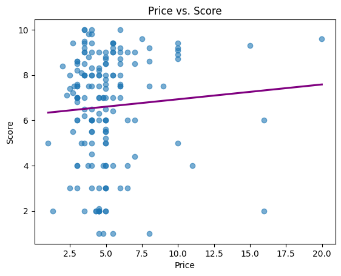
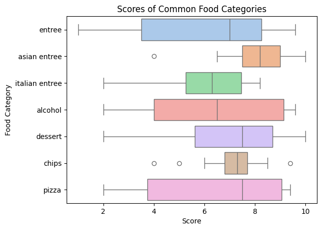

# Trader Joe's Product Review Analysis
This project analyzes ratings from YouTuber JonnyCakes' reviews of Trader Joe's products.

The project consists of two stages:
1. Cleaning and integrating raw review data with historical Trader Joe's pricing information.
2. Performing exploratory data analysis to identify trends between ratings, price, storage type, and food category.

## Skills Demonstrated

- Data Cleaning
- Data Wrangling
- Exploratory Data Analysis (EDA)
- Data Visualization
- Feature Engineering
- Data Validation
- Python
- pandas
- NumPy
- Matplotlib
- Seaborn

## Project Goals

This project was created to practice a complete data analysis workflow from JonnyCakes' insights on various Trader Joe's products.

Goals included:

- Cleaning inconsistent datasets
- Recovering missing values
- Combining multiple datasets
- Performing exploratory data analysis
- Communicating findings through visualizations

## Dataset

Two datasets were used.

### Review Dataset

Collected manually from JonnyCakes' Trader Joe's review videos.

Includes:

- Product name
- Review score
- Review date
- Original product category (from the video)

### Price Dataset

Historical Trader Joe's pricing data. This is sourced from traderjoesprices.com.

Information used during cleaning:

- Product name
- Product price
- Date price was recorded

## Data Cleaning

The cleaning pipeline included:

- Standardized text formatting across datasets
- Removed unnecessary columns
- Converted dates and prices into usable formats
- Recovered missing prices using historical price matching (`merge_asof`)
- Applied manual price corrections for unmatched products
- Normalized product categories (splitting original categories into two new ones)
- Added higher-level storage type classifications
- Validated the cleaned dataset before export

## Exploratory Analysis

Questions explored included:

- Does a Trader Joe's product's price affect its rating?
- Which food categories receive the highest/lowest ratings?
- How does a product's storage type affect the score given?
- How are review scores distributed?

## Key Findings

- Product price showed little correlation with review scores, suggesting that higher-priced items were not consistently rated more favorably.
- Asian entrees consistently ranked among the highest-rated food categories.
- Bakery products earned the highest average ratings from JonnyCakes, suggesting they were among his favorite storage categories.
- Several products in the "budget" price group received ratings almost comparable to higher priced items.

## Technologies

- Python
- pandas
- NumPy
- Matplotlib
- Seaborn
- Jupyter Notebook

## Future Improvements

Potential future work includes:

- Analyzing review trends over time
- Comparing ratings across multiple reviewers
- Building an interactive dashboard with Plotly or Tableau

## What I Learned

Through this project I gained experience with:

- Collecting and cleaning datasets
- Joining historical datasets using `merge_asof`
- Building reusable data-cleaning pipelines
- Designing effective visualizations
- Communicating analytical findings
